# chs-gov-uk-notify-integration-api

```mermaid
flowchart LR
    ExternalApp["External CHS App"] -->|REST| Module1
    Module1["sender-api"] -->|Kafka| Module2
    Module2["kafka-consumer"] -->|REST| Module3
    Module3["📌 govuk-notify-api"] -->|REST| GovUKNotify
    GovUKNotify["GovUK Notify"]
    
    subgraph PoseidonSystem["🔱 chs-notification"]
        Module1
        Module2
        Module3
    end
    
    %% Styling for all elements - light/dark mode compatible
    classDef normal fill:#f8f8f8,stroke:#666666,stroke-width:1px,color:#333333,rx:4,ry:4
    classDef current fill:#0099cc,stroke:#007799,stroke-width:2px,color:white,rx:4,ry:4
    classDef external fill:#e6e6e6,stroke:#999999,stroke-width:1px,color:#333333,rx:4,ry:4
    classDef system fill:transparent,stroke:#0077b6,stroke-width:1.5px,stroke-dasharray:3 3,color:#00a8e8,rx:10,ry:10
    
    class Module1 normal;
    class Module2 normal;
    class Module3 current;
    class ExternalApp external;
    class GovUKNotify external;
    class PoseidonSystem system;
    %% Adding clickable links to GitHub repos
    click Module1 "https://github.com/companieshouse/chs-notification-sender-api" _blank
    click Module2 "https://github.com/companieshouse/chs-notification-kafka-consumer" _blank
```



## Overview

This service:
- Receives notification requests from chs-notification-kafka-consumer (Module 2)
- Sends email and letter notifications to GovUK Notify via their API
- Is Module 3 of 3 in the [chs-notification system](https://companieshouse.atlassian.net/wiki/spaces/IDV/pages/5146247171/EMail+Service)

## Related Services

- [chs-notification-sender-api](https://github.com/companieshouse/chs-notification-sender-api) (Module 1, accepts email/letter requests via REST and publishes to Kafka topics consumed by Module 2)
- [chs-notification-kafka-consumer](https://github.com/companieshouse/chs-notification-kafka-consumer) (Module 2, consumes from Kafka topics published by Module 1 and sends requests to Module 3 via REST)

## Endpoints

The service exposes the following endpoints:

- **Main API endpoints**: See [API Documentation](https://github.com/companieshouse/private.api.ch.gov.uk-specifications/tree/master/generated_sources/docs/chs-gov-uk-notify-integration-api)
- **Service health**: `GET /gov-uk-notify-integration/healthcheck`

## Prerequisites

- Java 21
- Maven

## Running Locally

### Prerequisites
Sign up to [GovUK Notify](https://www.notifications.service.gov.uk/) or get a API key from a teammate.

Set environment variables for GovUK Notify integration:
```bash
export CHS_GOV_UK_NOTIFY_INTEGRATION_API_KEY=your_api_key_here
```

### Running the Application

#### Option 1: Using IntelliJ IDEA
1. Open the project in IntelliJ
2. Set Project SDK to Java 21
3. Locate the main application class: [ChsGovUkNotifyIntegrationService.java](src/main/java/uk/gov/companieshouse/chs/gov/uk/notify/integration/api/ChsGovUkNotifyIntegrationService.java)
4. Right-click and select "Run" or "Debug"

#### Option 2: Using Maven CLI
```bash
mvn spring-boot:run
```

## Repository Structure

```
chs-gov-uk-notify-integration-api/
│── src/                    
│   ├── main/               # Main application code
│   └── test/               # Test code
│── pom.xml                 # Dependencies
│── api-collections/
│   └── postman/            # Postman API collections
│── ecs-image-build/        # ECS Dockerfile
│── terraform/              # Infrastructure code
│── ...                     # Other files/folders
└── README.md               # This file
```

## Adding a New Letter

### Steps to add a new template

1. Identify the client service in question, and create or reuse the letter assets directory for that client. We currently have the `assets/templates/letters/chips` directory for our CHIPS client application.
1. Start with a letter design - probably a PDF, and evolve HTML and CSS resources to reproduce the letter as a web document. Bear in mind that some of the formatting of these letters will be print media specific, so it is not until you are producing PDFs that you will know exactly what the resulting letter will look like.
1. Place common resources in the `assets/templates/letters/common` directory.
1. Place those resources specific to the letter you are adding in the appropriate client directory. For example, if your letter type is `CSIDVDEFLET` and you are creating a new template `v2.0` for `chips`, resources will go to `assets/templates/letters/chips/CSIDVDEFLET/v2.0/`. 
1. Set up context validation to ensure that the required variable values are present to be able to create, print and send valid letters out. Extend `TemplateContextValidator.VALID_CONTEXTS` with an additional entry to do so.
1. Test the result (of course!). 

### Background

Template resources for letters are to be grouped by the client service or app that originates the request to send a letter. For example, if a letter request is made by the CHIPS application, its template resources will reside in the `chips` letter assets directory.

Resources are then grouped by letter id and template id. For example, for a new template `v2.0` for the `CSIDVDEFLET` letter id, its template resources will reside in the `CSIDVDEFLET/v2.0` subdirectory.

We have a number of HTML and CSS resources starting with a "root" HTML template file named `template.html` that brings in the other files to create the final template.

Resources that may be reused across various types of letter should be placed in the `common` directory.

The letter template that results from the resolving of the root template and its dependencies is a Thymeleaf HTML/CSS template with a number of substitution variables in it, covering those values that must change from letter to letter.

The application uses a Thymeleaf templating engine to perform the required substitutions. However, this will not validate for missing values for these substitutions. Hence, we build a validation model which essentially checks that the required values for the letter to be printed and sent have been provided. If we didn't do this validation, there would be the risk of printing and sending letters with essential information missing from them. 

## Terraform ECS

### What does this code do?

The code present in this repository is used to define and deploy a dockerised container in AWS ECS.
This is done by calling a [module](https://github.com/companieshouse/terraform-modules/tree/main/aws/ecs) from terraform-modules. Application specific attributes are injected and the service is then deployed using Terraform via the CICD platform 'Concourse'.


Application specific attributes | Value                                | Description
:---------|:-----------------------------------------------------------------------------|:-----------
**ECS Cluster**        |{{notifications}}                                      | ECS cluster (stack) the service belongs to
**Load balancer**      |{env}-{{chs-internalapi}}                                            | The load balancer that sits in front of the service
**Concourse pipeline**     |[Pipeline link]({{https://ci-platform.companieshouse.gov.uk/teams/team-development/pipelines/chs-gov-uk-notify-integration-api}}) <br> [Pipeline code]({{https://github.com/companieshouse/ci-pipelines/blob/master/pipelines/ssplatform/team-development/chs-gov-uk-notify-integration-api}})                                  | Concourse pipeline link in shared services


### Contributing
- Please refer to the [ECS Development and Infrastructure Documentation](https://companieshouse.atlassian.net/wiki/spaces/DEVOPS/pages/4390649858/Copy+of+ECS+Development+and+Infrastructure+Documentation+Updated) for detailed information on the infrastructure being deployed.

### Testing
- Ensure the terraform runner local plan executes without issues. For information on terraform runners please see the [Terraform Runner Quickstart guide](https://companieshouse.atlassian.net/wiki/spaces/DEVOPS/pages/1694236886/Terraform+Runner+Quickstart).
- If you encounter any issues or have questions, reach out to the team on the **#platform** slack channel.

### Vault Configuration Updates
- Any secrets required for this service will be stored in Vault. For any updates to the Vault configuration, please consult with the **#platform** team and submit a workflow request.

### Useful Links
- [ECS service config dev repository](https://github.com/companieshouse/ecs-service-configs-dev)
- [ECS service config production repository](https://github.com/companieshouse/ecs-service-configs-production)

